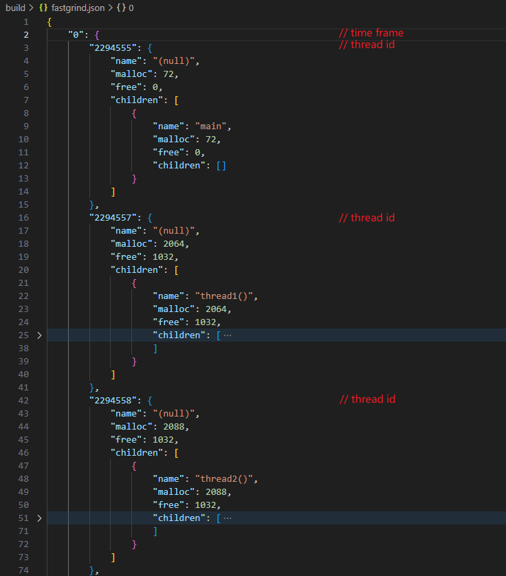
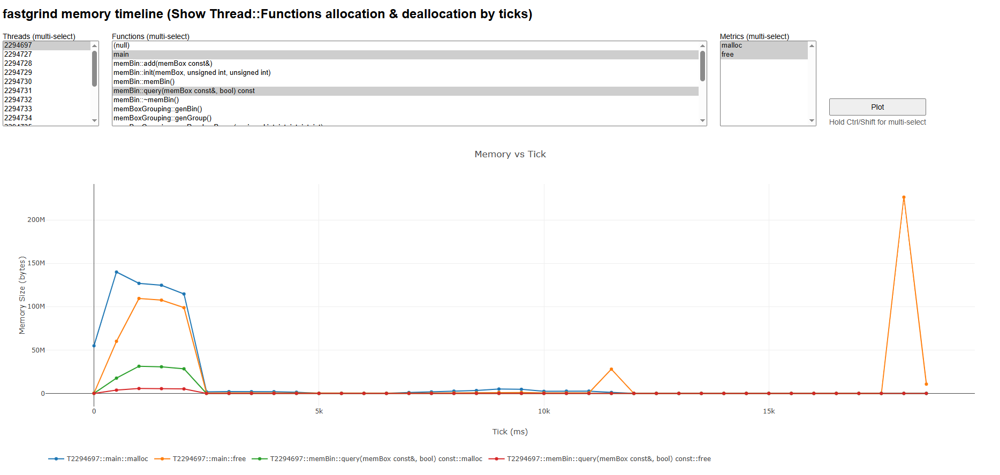

# Fastgrind

## Overview

**Fastgrind** is a head-only, lightweight, fast, thread safe, valgrind-like memory profiler designed for runtime memory allocation tracking and call stack analysis in C++ applications. Fastgrind provides comprehensive memory usage insights through both automatic and manual instrumentation approaches.

## Repository Structure

```
fastgrind/
├── include/fastgrind.h           # Core code (head only)
│
├── demo/
│   ├── manual_instrument/        # Manual instrumentation demos
│   ├── auto_instrument/          # Automatic instrumentation demos  
│   └── build_all_demo.sh         # Build all individual demo
│
├── testcase/
│   ├── benchmark_box_grouping/   # Performance benchmarking
│   ├── cpp_feature_test/         # Modern C++ feature test
│   ├── glibc_je_tc_availabe/     # Allocator compatibility test
│   ├── multi_pkg_compile/        # Multi-package compilation test
│   ├── thirdparty_leveldb_test/  # Third-party open source library test (https://github.com/google/leveldb)
│   └── thirdparty_zlib_test      # Third-party open source library test (https://zlib.net)
│
├── doc/
│   ├── compile.md                # Description of integrate and compile
│   ├── demo.md                   # Description of demo
│   ├── feature_list.md           # Description of fastgrind's feature
│   ├── querstion_list.md         # Description of problems and solutions in using fastgrind
│   └── testcase.md               # Description of testcase
│
├── tools/fastgrind.py            # Binary trace tools (python tools/fastgrind.py ui fastgrind.fgb)
│
├── CMakeList.txt                 # Top Cmake for testcase
├── Doxyfile                      # Doxyfile to generate manual
└── README.md                     # Description of repository
```

## Quick Start

### Complie testcase

```bash
mkdir build && cd build
cmake ..
make -j$(nproc)
```

### Run testcase

```bash
cd build/testcase/benchmark_box_grouping
./benchmark_raw
./benchmark_fastgrind
./run_valgrind.sh

cd build/testcase/cpp_feature_test
./cpp_feature_test

...

cd build/testcase/multi_pkg_compile
./multi_pkg_main
```

### Call Stack Report
Two report file will be generated when program exits

```bash
[FASTGRIND] Start summary memory info
[FASTGRIND] saved: fastgrind.text (size=2335 bytes)
[FASTGRIND] saved: fastgrind.fgb (size=5601 bytes)
```
**For more file detail**, please check: [Output and Analysis](#output-and-analysis)


## Using In Your Project

For CMake consumers, the recommended path is to use the exported interface targets instead of copying compiler and linker flags by hand.

### Install fastgrind

Build and install fastgrind to any prefix before using `find_package`. The example below installs into `$HOME/.local` so no system-wide write access is required.

```bash
cmake -S . -B build -DFASTGRIND_BUILD_TESTS=OFF -DFASTGRIND_INSTALL=ON
cmake --build build -j$(nproc)
cmake --install build --prefix "$HOME/.local"
```

Then point your consumer project at that prefix when configuring it:

```bash
cmake -S . -B build -DCMAKE_PREFIX_PATH="$HOME/.local"
cmake --build build -j$(nproc)
```

### **Recommended CMake Integration**

#### 1. Installed package: `find_package`

```cmake
find_package(fastgrind CONFIG REQUIRED)

add_executable(my_app main.cpp)
target_link_libraries(my_app PRIVATE fastgrind::manual)
# Or: fastgrind::auto
```

Use this when fastgrind is already installed. If it is not installed into a standard prefix, configure your app with `-DCMAKE_PREFIX_PATH=/path/to/prefix`.

#### 2. Download at configure time: `FetchContent`

```cmake
include(FetchContent)

FetchContent_Declare(
    fastgrind
    GIT_REPOSITORY https://github.com/adny-code/fastgrind.git
    GIT_TAG main
)

set(FASTGRIND_BUILD_TESTS OFF CACHE BOOL "" FORCE)
set(FASTGRIND_INSTALL OFF CACHE BOOL "" FORCE)

FetchContent_MakeAvailable(fastgrind)

add_executable(my_app main.cpp)
target_link_libraries(my_app PRIVATE fastgrind::auto)
```

Use this when you want CMake to download fastgrind automatically.


**For detail compile & link options**, please check: [doc/compile.md](doc/compile.md)

### **Manual Instrumentation**
```cpp
#include "fastgrind.h"

using namespace __FASTGRIND__;

void processData() {
    FAST_GRIND;                       // Enable call stack tracking for this function
    
    int* data = new int[1000];
    // ... process data ...
    delete[] data;
}

int main() {
    FAST_GRIND;                       // Enable call stack tracking for this function
    processData();
    return 0;
}
```

### **Auto Instrumentation**

Include **fastgrind.h** in any one of source code, and with compile options, All functions outside the exclude file are automatically instrumented


## Output and Analysis
​When a Fastgrind-instrumented application exits, two files are automatically generated: `fastgrind.text` and `fastgrind.fgb` 

### **fastgrind.text**
​This is a linux perf like report


### **fastgrind.fgb**
Structured binary trace containing:
- Time-sliced memory usage statistics  
- Per-thread memory allocation details
- Complete call stack information
- Function-level allocation breakdown

Use `python tools/fastgrind.py export-json fastgrind.fgb` only when a compatibility JSON is needed for debugging.

**Per-time frame, per-thread, per function recorder**:

- Single thread


- Multi thread




## Visualization
Use `tools/fastgrind.py` as the primary binary trace tool.

The default workflow is the Python-first UI:

```bash
python tools/fastgrind.py ui fastgrind.fgb
```

Other useful commands:

```bash
python tools/fastgrind.py inspect fastgrind.fgb
python tools/fastgrind.py html fastgrind.fgb
python tools/fastgrind.py html fastgrind.fgb --no-browser --port 8000
python tools/fastgrind.py export-html fastgrind.fgb
python tools/fastgrind.py export-json fastgrind.fgb
```

HTML remains available as a secondary workflow. `export-html` writes a compact snapshot instead of embedding the full trace.
In headless or dependency-limited environments, `ui` will fall back to `html`, and both commands can be kept local with `--no-browser` plus a fixed `--port`.

**Usage**

```bash
python tools/fastgrind.py ui fastgrind.fgb
python tools/fastgrind.py ui     # auto search fastgrind.fgb in current folder
python tools/fastgrind.py ui fastgrind.fgb --no-browser --port 8000
```

- **matplot**


- **html**




## Limitations and Considerations

- **Cross-Frame Allocation**: Memory allocated in one function and freed in another will be recorded truthfully, resulting in those function stack frames freed less or more then allocated.
- **Template Complexity**: Complex template metaprogramming may show generic names in reports
- **File Overwriting**: Output files overwrite previous content on each run
- **System Dependencies**: Requires GNU ld for `--wrap` functionality


## Contributing and Support

For questions, bug reports, or contributions, please contact us:
- **Email**: zfzmalloc@gmail.com
- **GitHub**: https://github.com/adny-code/fastgrind
- **Issues**: Report bugs and feature requests via GitHub Issues


## License

This project is licensed under the MIT License. See `LICENSE` file for details.
