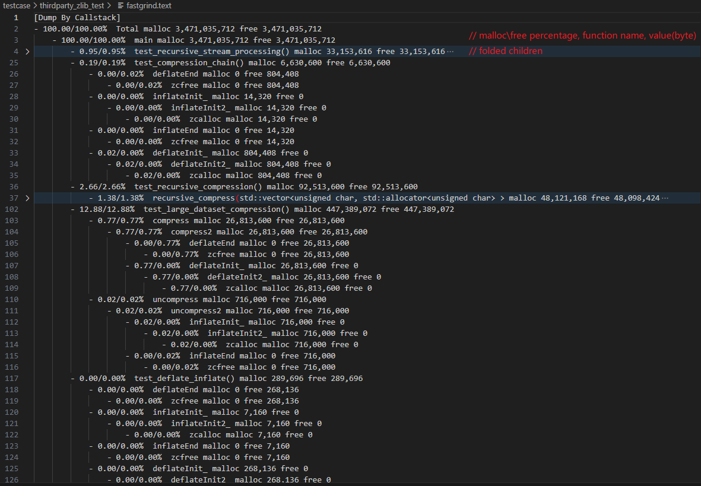
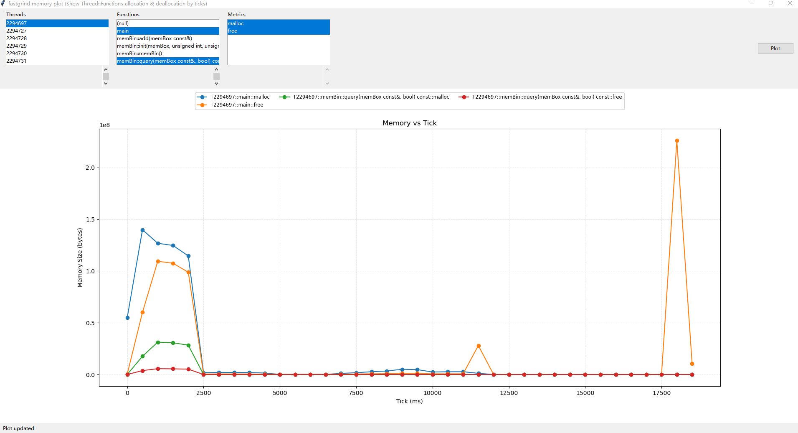

# Fastgrind

## Overview

**Fastgrind** is a head-only, lightweight, fast, thread safe, valgrind-like memory profiler designed for runtime memory allocation tracking and call stack analysis in C++ applications. Fastgrind provides comprehensive memory usage insights through both automatic and manual instrumentation approaches.

## Repository Structure

```
fastgrind/
├── include/fastgrind.h           # Core code (head only)
|
├── demo/                         # Instrumentation examples
│   ├── manual_instrument/        # Manual instrumentation demos
│   ├── auto_instrument/          # Automatic instrumentation demos  
|   ├── build_all_demo.sh         # Build all individual demo
|   └── README.md                 # Description of demo and auto/manual instrument
|
├── testcase/                     # Feature validation and benchmarks
│   ├── benchmark_box_grouping/   # Performance benchmarking
│   ├── cpp_feature_test/         # Modern C++ feature test
│   ├── glibc_je_tc_availabe/     # Allocator compatibility test
│   ├── multi_pkg_compile/        # Multi-package compilation test
|   ├── thirdparty_leveldb_test/  # Third-party open source library test (https://github.com/google/leveldb)
|   ├── thirdparty_zlib_test      # Third-party open source library test (https://zlib.net)
|   └── README.md                 # Description of testcase and support features
|
├── tools/fastgrind.py            # Visualize utilities (python fastgrind.py fastgrind.json)
|
├── CMakeList.txt                 # Top Cmake for testcase
├── Doxyfile                      # Doxyfile to generate manual
└── README.md                     # Description of repository
```


### **Core Functionality**

	The `fastgrind.h` header provides a single-file solution for memory profiling with the following key features:

### **Memory Allocation Interception**

For more details, please check `testcase/README.md`

- Wraps standard allocation functions (`malloc`, `calloc`, `realloc`, `free`)
- Intercepts C++ operators (`new`, `new[]`, `delete`, `delete[]`, including nothrow variants)
- Supports POSIX memory functions (`posix_memalign`, `memalign`, `valloc`)
- Compatible with aligned memory allocation functions (C++17)

#### **Call Stack Management**

The library provides two distinct approaches for function instrumentation:

For more details, please check  `demo/README.md`

##### **Manual Instrumentation Call Stack Management**

​	Use `FAST_GRIND` macro for explicit stack frame tracking

```cpp
void myFunction() {
    __FASTGRIND__::FAST_GRIND;  // Explicit call stack tracking
    // Function implementation
}
```

##### **Automatic Instrumentation Call Stack Management**  
- **Compiler-Driven Tracking**: Automatic insertion of instrumentation calls by compiler
- **Comprehensive Coverage**: All functions automatically included in call stack tracking
- **Symbol Resolution**: Automatic function name extraction from call addresses using runtime symbol lookup
- **Advanced Filtering**: System header exclusion lists prevent tracking unwanted functions
- **Complex Configuration**: Requires advanced compiler flags and exclusion patterns

```cpp
// With -DFASTGRIND_INSTRUMENT flag, all functions automatically tracked
void myFunction() {
    // No manual macro needed - automatically instrumented
}
```

#####  **Call Stack Report**
If fastgrind is integrated into the project code, two files will be generated after the program ends

For example:

```bash
[Grouping] multi thread test: 509 ms
[FASTGRIND] Start summary memory info
[FASTGRIND] saved: fastgrind.text (size=2335 bytes)
[FASTGRIND] saved: fastgrind.json (size=65952 bytes)
```

**For more file detail**, please check: [Output and Analysis](#output-and-analysis)

##### **Common Features (Both Approaches)**
- **Configurable Depth**: Adjustable call stack capture depth (default: 64 frames)
- **Symbol Resolution**: Function name extraction from call addresses
- **Cross-Platform Support**: Works on various Unix-like systems

#### **Thread-Safe Architecture**
- **Per-Thread Local Storage**: Minimizes contention with thread-local accumulators
- **Global Aggregation**: Periodic merging into mutex-protected global container
- **Recursion Protection**: Thread-local guards prevent instrumentation recursion


### API Reference

#### **Configuration Macros**

```cpp
// Not defined, if needed, define it in compile flags
#define FASTGRIND_INSTRUMENT          // Enable automatic instrumentation
#define FASTGRIND_JE_MALLOC           // Use jemalloc allocator
#define FASTGRIND_TC_MALLOC           // Use tcmalloc allocator

// Primary instrumentation macro
#define FAST_GRIND fastgrind __fg(__FUNCTION__)

// Defined, could be modified in fastgrind.h
#define FAST_GRIND_STATUS 1           // Enable/disable profiling globally
#define __MEM_MAX_STACK_DEPTH 64      // Default tracking stack depth
#define __MEM_SAMPLE_INTERVAL_MS 500  // Default time frame (ms)
```

### Usage

For more details, please check `demo/README.md`

#### **Manual Instrumentation**
```cpp
#include "fastgrind.h"

using namespace __FASTGRIND__;

void processData() {
    FAST_GRIND;                       // Enable call stack tracking for this function
    
    int* data = new int[1000];        // Tracked allocation
    // ... process data ...
    delete[] data;                    // Tracked deallocation
}

int main() {
    FAST_GRIND;
    processData();
    return 0;                         // Output files generated at program exit
}
```

#### **Auto Instrumentation**

Include **fastgrind.h** in any one of source code, and with compile options, All functions outside the exclude file are automatically instrumented


### Scope of Application

Fastgrind is particularly well-suited for:

- **Performance-Critical Applications**: Minimal overhead design for production use
- **Memory Leak Detection**: Identify allocation/deallocation mismatches
- **Memory Usage Optimization**: Analyze allocation patterns and hotspots
- **Multi-threaded Applications**: Thread-safe tracking across concurrent operations
- **Large-Scale C++ Projects**: Multi-package compilation and linking support
- **Third-party Library Integration**: Non-intrusive instrumentation of external dependencies

### Limitations
 - When a block of memory is allocated and released in different function stack frames, it will be recorded truthfully, resulting in the memory allocated and released in those function stack frames being mismatched
 - Weak support for template metaprogramming and anonymous functions in summary report

### Configuration

- The default max callstack depth is 64. You can modify macro __MEM_MAX_STACK_DEPTH to increase this limition.

## Build and Compilation

### Quick Start

```bash
# Configure and build
mkdir build && cd build
cmake ..
make -j$(nproc)

# Install system-wide (optional)
sudo make install
```

### Manual Instrumentation Setup

#### **Compiler Flags**
```bash
g++ -O3 -Wall -Wextra -std=c++11 \
    -I/path/to/fastgrind/include \
    source_files...
    # -DFASTGRIND_JE_MALLOC (if use jemalloc)
    # -DFASTGRIND_TC_MALLOC (if use tcmalloc)
```

#### **Linker Options**
```bash
# Essential wrap flags for memory function interception
-Wl,--wrap=malloc -Wl,--wrap=calloc -Wl,--wrap=realloc -Wl,--wrap=free \
-Wl,--wrap=_Znwm -Wl,--wrap=_Znam -Wl,--wrap=_ZdlPv -Wl,--wrap=_ZdaPv \
-Wl,--wrap=posix_memalign -Wl,--wrap=memalign -Wl,--wrap=valloc \
other_wrap_flags...
-Wl,--wrap=_ZdlPvmSt11align_val_tRKSt9nothrow_t -Wl,--wrap=_ZdaPvmSt11align_val_tRKSt9nothrow_t
```

### Automatic Instrumentation Setup
	Here is a example to setup Makefile

#### **Compiler Flags**
```bash
EXCLUDE_FILE_LISTS=(
    /usr/include/c++/
    /usr/include/x86_64-linux-gnu/c++/
    /usr/lib/gcc/
    /usr/include/x86_64-linux-gnu/
    /usr/include/linux/
    other_path...
    ${REPO_ROOT}/third_party/
)
EXCLUDE_FILE_LISTS=$(IFS=,; echo "${EXCLUDE_FILE_LISTS[*]}")  # remove space

INSTRUMENT_FLAGS=(
  -finstrument-functions
  -finstrument-functions-exclude-file-list=${EXCLUDE_FILE_LISTS}
)

g++ -O3 -Wall -Wextra -std=c++11 \
    ${INSTRUMENT_FLAGS[@]} \            # exclude instrument lists
    -DFASTGRIND_INSTRUMENT \            # define FASTGRIND_INSTRUMENT for auto instrument
    -Wl,--export-dynamic \              # export symbol
    -I/path/to/fastgrind/include \
    source_files...
    # -DFASTGRIND_JE_MALLOC (if use jemalloc)
    # -DFASTGRIND_TC_MALLOC (if use tcmalloc)
```

#### **Linker Options**
```bash
# Essential wrap flags for memory function interception
-Wl,--wrap=malloc -Wl,--wrap=calloc -Wl,--wrap=realloc -Wl,--wrap=free \
-Wl,--wrap=_Znwm -Wl,--wrap=_Znam -Wl,--wrap=_ZdlPv -Wl,--wrap=_ZdaPv \
-Wl,--wrap=posix_memalign -Wl,--wrap=memalign -Wl,--wrap=valloc \
other_wrap_flags...
-Wl,--wrap=_ZdlPvmSt11align_val_tRKSt9nothrow_t -Wl,--wrap=_ZdaPvmSt11align_val_tRKSt9nothrow_t
```


## Supported Features and Compatibility

### C++ Language Features

Based on comprehensive testing in `testcase/cpp_feature_test/`:

#### **Fully Supported**
- ✅ **RAII and Smart Pointers**: `std::unique_ptr`, `std::shared_ptr`, custom RAII classes
- ✅ **STL Containers**: `std::vector`, `std::map`, `std::unordered_map`, etc.
- ✅ **Modern C++ (C++11/14/17)**: Auto, lambdas, range-based loops
- ✅ **Namespace Operations**: Multi-level namespaces, using declarations
- ✅ **Template Instantiation**: Class and function templates
- ✅ **Exception Handling**: Memory tracking across exception boundaries

#### **Limited Support**
- ⚠️ **Template Metaprogramming**: Complex template constructs may show generic names
- ⚠️ **Anonymous Functions**: Lambda expressions may appear as unnamed in reports

### Memory Allocator Compatibility

Validated through `testcase/glibc_je_tc_availabe/`:

#### **Standard C Library Functions**
- ✅ `malloc`, `calloc`, `realloc`, `free`
- ✅ `posix_memalign`, `memalign`, `valloc`
- ✅ Zero-size allocation handling
- ✅ NULL pointer safety

#### **C++ Operators**
- ✅ `operator new`, `operator new[]`
- ✅ `operator delete`, `operator delete[]`
- ✅ Nothrow variants (`std::nothrow`)
- ✅ Aligned allocation (C++17): `operator new`/`delete` with `std::align_val_t`

#### **Third-Party Allocators**
- ✅ **jemalloc**: Full compatibility with je_malloc family
- ✅ **tcmalloc**: Complete support for tc_malloc functions
- ✅ **glibc malloc**: Standard system allocator support

### Multi-Threading Support

- ✅ **Thread-Local Storage**: Per-thread memory tracking without contention
- ✅ **Concurrent Allocations**: Safe tracking across multiple threads
- ✅ **Cross-Thread Analysis**: Global aggregation of per-thread statistics
- ✅ **Thread Creation/Destruction**: Proper cleanup on thread exit

### Build System Integration

Demonstrated in `demo/` directory:

- ✅ **CMake**: Modern CMake (3.10+) with proper dependency management
- ✅ **GNU Make**: Traditional Makefile-based builds
- ✅ **Bash Scripts**: Simple script-based compilation
- ✅ **Multi-Package Projects**: Static library compilation and linking

## Output and Analysis

​	When a Fastgrind-instrumented application exits, two files are automatically generated: `fastgrind.text` and `fastgrind.json` 

### **fastgrind.text**
​	This is a linux perf like report



### **fastgrind.json**
Structured JSON format containing:
- Time-sliced memory usage statistics  
- Per-thread memory allocation details
- Complete call stack information
- Function-level allocation breakdown

**Per-time frame, per-thread, per function recorder**:

- Single thread


- Multi thread


## **Visualization**
Use tools/fastgrind.py to generate interactive visual line chart

It will call matplotlib to draw line chart, and generate `fastgrind.html` in case without matplotlib

Use web browser to open `fastgrind.html` can get same line chart

**Usage**

```python
python fastgrind.py fastgrind.json
or 
python fastgrind.py     # auto search fastgrind.json in current folder
```

- **matplot**



- **html**


## Demonstrations and Examples

The `demo/` directory provides comprehensive examples for both instrumentation approaches:

### Available Demos

#### **Simple Examples**
- `manual_instrument/simple_demo/` - Basic single-file manual instrumentation
- `auto_instrument/simple_demo/` - Basic single-file automatic instrumentation

#### **Build System Examples**
- `compile_with_bash/` - Bash script-based multi-package compilation
- `compile_with_cmake/` - CMake-based modern build configuration  
- `compile_with_makefile/` - GNU Make traditional build approach

### Quick Demo Execution

```bash
# Build all demos
./demo/build_all_demo.sh

# Or run individual demos
cd demo/manual_instrument/simple_demo
./build.sh && ./build/app

cd demo/auto_instrument/compile_with_cmake
mkdir build && cd build && cmake .. && make && ./app
```

## Benchmarking and Validation

The `testcase/` directory contains comprehensive validation suites:

### Benchmark
- **Raw Execution**: Baseline performance without instrumentation
- **Fastgrind Execution**: Measure instrumentation overhead
- **Valgrind Comparison**: Performance comparison with Valgrind

```bash
cd build/testcase/benchmark_box_grouping
./benchmark_raw          # Baseline
./benchmark_fastgrind    # With Fastgrind
./run_valgrind.sh        # Valgrind comparison
```


### Feature Validation

- **Modern C++ Features** (`cpp_feature_test/`)

- **Allocator Compatibility** (`glibc_je_tc_availabe/`)  

- **Multi-Package Compilation** (`multi_pkg_compile/`)

- **Third-Party Integration** (`thirdparty_*/`)

  

### Third-party Test
- **leveldb** (`thirdparty_leveldb_test`)

- **zlib** (`thirdparty_zlib_test`)

  


## Limitations and Considerations

- **Cross-Frame Allocation**: Memory allocated in one function and freed in another will show mismatched statistics

- **Template Complexity**: Complex template metaprogramming may show generic names in reports

- **File Overwriting**: Output files overwrite previous content on each run

- **System Dependencies**: Requires GNU ld for `--wrap` functionality

  

## Contributing and Support

For questions, bug reports, or contributions, please contact us:
- **Email**: zfzmalloc@gmail.com
- **GitHub**: https://github.com/adny-code/fastgrind
- **Issues**: Report bugs and feature requests via GitHub Issues

## License

This project is licensed under the MIT License. See `LICENSE` file for details.
