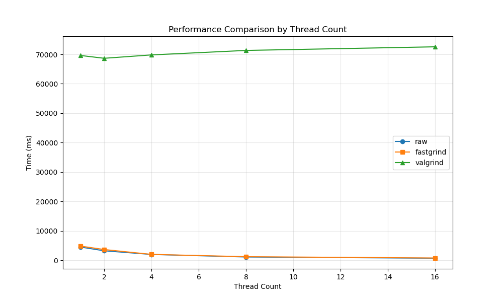

# Fastgrind Feature List

This is an introduction document about Fastgrind's feature

## Fastgrind.h Configuration Macros

```cpp
// Not defined, if needed, define it in compile flags
#define FASTGRIND_INSTRUMENT          // Enable automatic instrumentation
#define FASTGRIND_JE_MALLOC           // Use jemalloc allocator
#define FASTGRIND_TC_MALLOC           // Use tcmalloc allocator

// Primary instrumentation macro
#define FAST_GRIND fastgrind __fg(__FUNCTION__)

// Defined, could be modified in fastgrind.h
#define FAST_GRIND_STATUS 1           // Enable/disable profiling globally
#define __MEM_MAX_STACK_DEPTH 64      // Default tracking stack depth
#define __MEM_SAMPLE_INTERVAL_MS 500  // Default time frame (ms)
```

## Key Features
- 🔍 **Memory Allocation Tracking**: Monitor malloc/free, new/delete, and POSIX memory functions
- 📊 **Call Stack Analysis**: Capture and analyze function call chains with configurable depth (default: 64 frames)
- 🧵 **Thread-Safe Operation**: Per-thread local tracking with global aggregation
- ⏱️ **Time-Based Aggregation**: Memory usage statistics organized by time slices
- 🔧 **Multiple Allocator Support**: Compatible with glibc, jemalloc, and tcmalloc
- 📈 **Performance Benchmarking**: Compare overhead against Valgrind
- � **Modern C++ Support**: Full compatibility with C++11/14/17 features

## Supported Features and Compatibility

### C++ Language Features

Based on comprehensive testing in `testcase/cpp_feature_test/`:

#### **Fully Supported**
- ✅ **RAII and Smart Pointers**: `std::unique_ptr`, `std::shared_ptr`, custom RAII classes
- ✅ **STL Containers**: `std::vector`, `std::map`, `std::unordered_map`, etc.
- ✅ **Modern C++ (C++11/14/17)**: Auto, lambdas, range-based loops
- ✅ **Namespace Operations**: Multi-level namespaces, using declarations
- ✅ **Template Instantiation**: Class and function templates
- ✅ **Exception Handling**: Memory tracking across exception boundaries

#### **Limited Support**
- ⚠️ **Template Metaprogramming**: Complex template constructs may show generic names
- ⚠️ **Anonymous Functions**: Lambda expressions may appear as unnamed in reports

### Memory Allocator Compatibility

Validated through `testcase/glibc_je_tc_availabe/`:

#### **Standard C Library Functions**
- ✅ `malloc`, `calloc`, `realloc`, `free`
- ✅ `posix_memalign`, `memalign`, `valloc`
- ✅ Zero-size allocation handling
- ✅ NULL pointer safety
- ⚠️ `mmap`, `munmap`, `mremap`, `sbrk`, `brk` are supported, but not turn on

#### **C++ Operators**
- ✅ `operator new`, `operator new[]`
- ✅ `operator delete`, `operator delete[]`
- ✅ Nothrow variants (`std::nothrow`)
- ✅ Aligned allocation (C++17): `operator new`/`delete` with `std::align_val_t`

#### **Third-Party Allocators**
- ✅ **jemalloc**: Full compatibility with je_malloc family
- ✅ **tcmalloc**: Complete support for tc_malloc functions
- ✅ **glibc malloc**: Standard system allocator support

### Multi-Threading Support

- ✅ **Thread-Local Storage**: Per-thread memory tracking without contention
- ✅ **Concurrent Allocations**: Safe tracking across multiple threads
- ✅ **Cross-Thread Analysis**: Global aggregation of per-thread statistics
- ✅ **Thread Creation/Destruction**: Proper cleanup on thread exit

### Build System Integration

Demonstrated in `demo/` directory:

- ✅ **CMake**: Modern CMake (3.10+) with proper dependency management
- ✅ **GNU Make**: Traditional Makefile-based builds
- ✅ **Bash Scripts**: Simple script-based compilation
- ✅ **Multi-Package Projects**: Static library compilation and linking


## Benchmark With Valgrind

Much Faster than valgrind, especially in multi thread applications.

Adjusting the testcase/benchmark_box_grouping, produces the following results:

